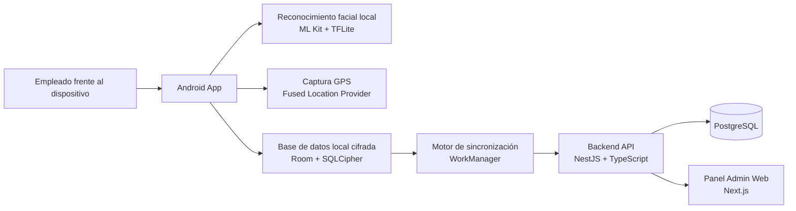
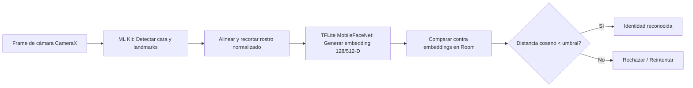
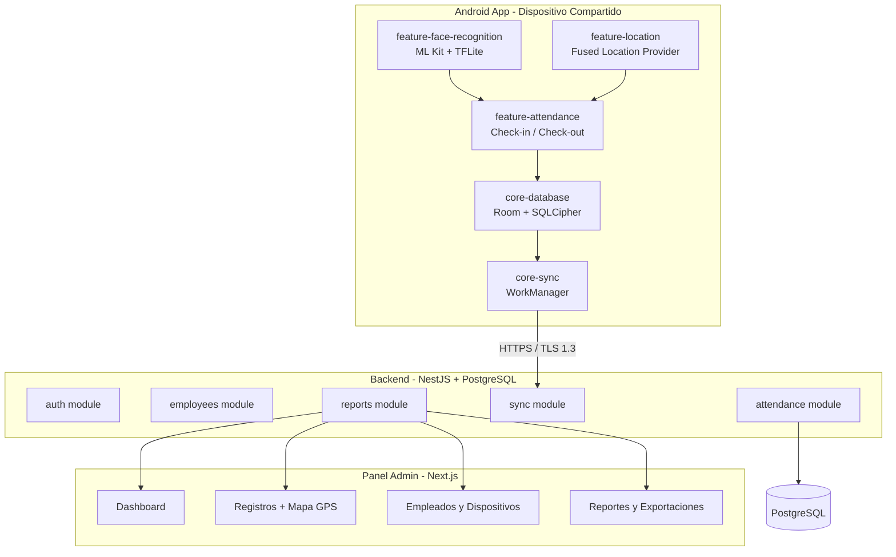
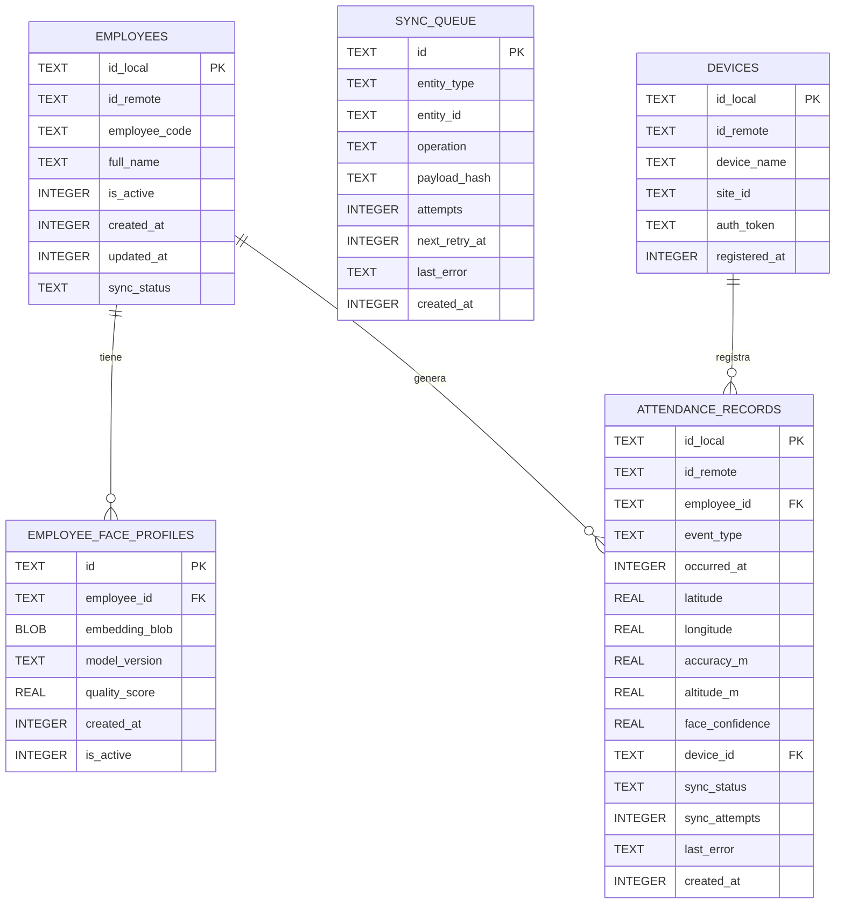
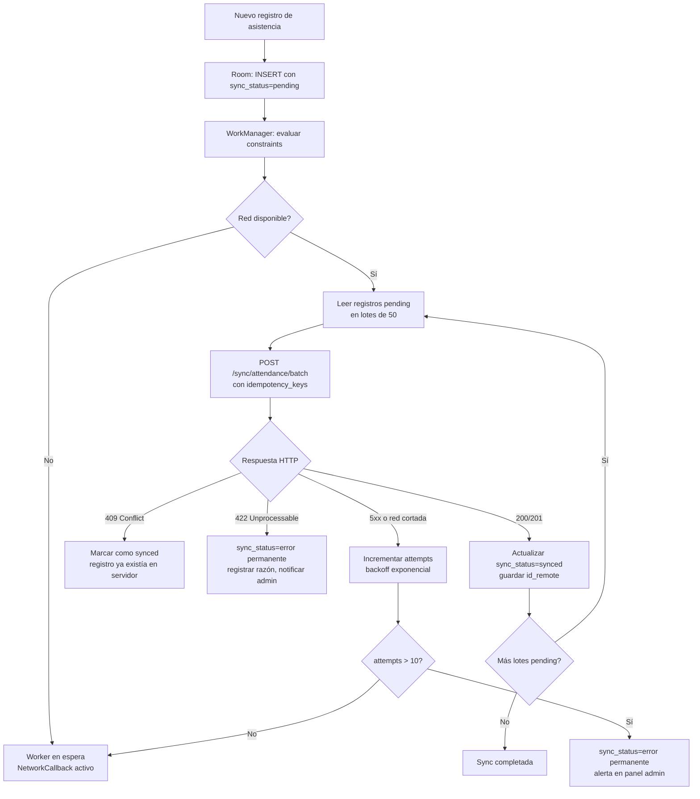
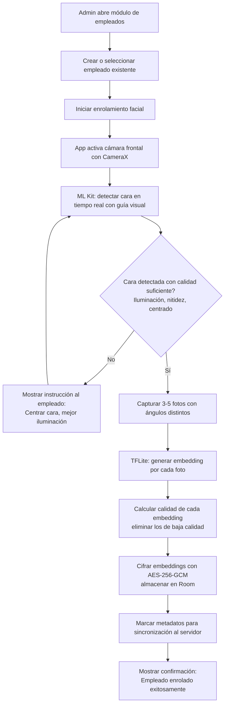
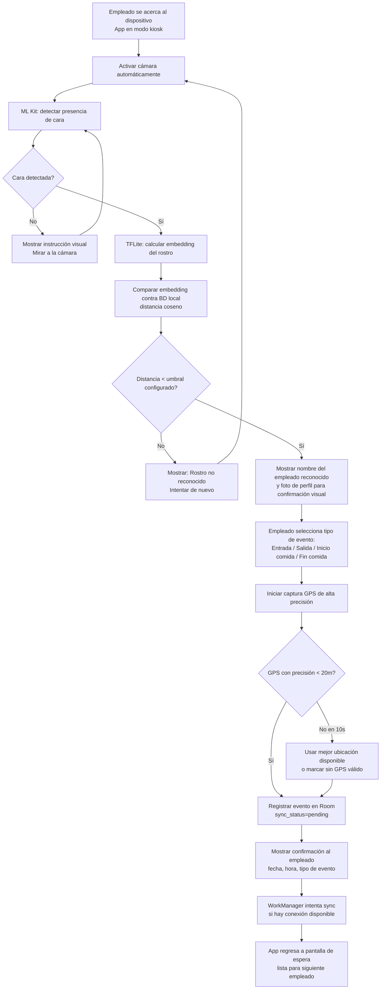
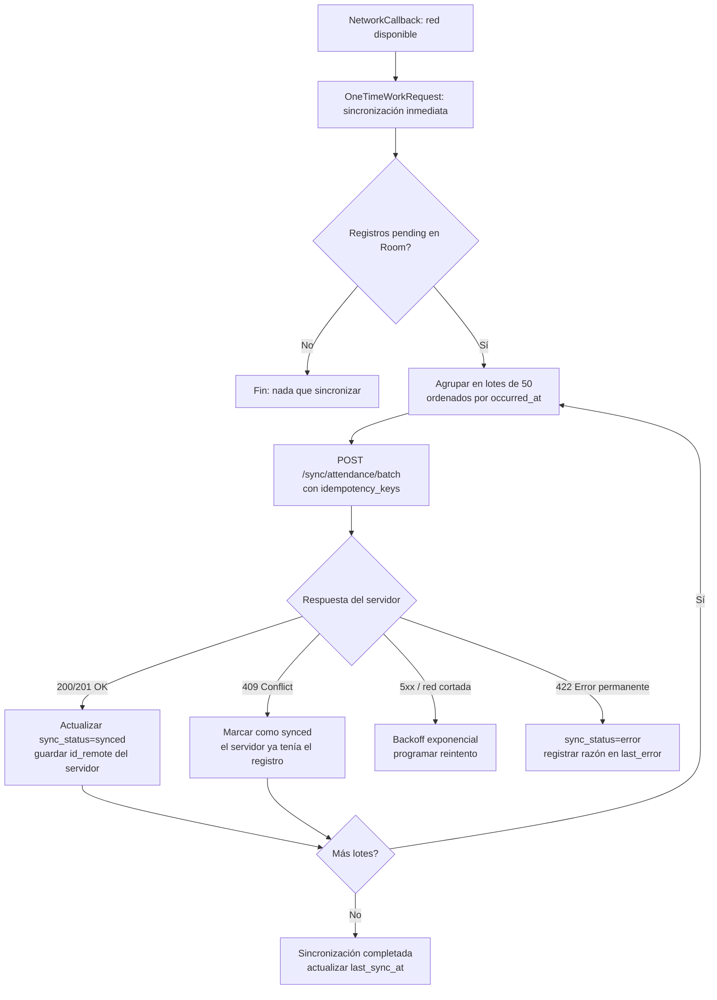

[architecture.md](https://github.com/user-attachments/files/28328139/architecture.md)
# Arquitectura del Sistema — Reloj Checador Android

> Documento de referencia arquitectónica para el desarrollo de la aplicación Android de control de asistencia con reconocimiento facial local, geolocalización y sincronización offline-first.

---

## Tabla de Contenidos

1. [Resumen Ejecutivo](#1-resumen-ejecutivo)
2. [Requisitos y Restricciones Técnicas](#2-requisitos-y-restricciones-técnicas)
3. [Stack Tecnológico Recomendado](#3-stack-tecnológico-recomendado)
4. [Comparativa ML Kit vs TensorFlow Lite](#4-comparativa-ml-kit-vs-tensorflow-lite)
5. [Arquitectura General del Sistema](#5-arquitectura-general-del-sistema)
6. [Diseño de Base de Datos Local (Room/SQLite)](#6-diseño-de-base-de-datos-local-roomsqlite)
7. [Diseño de Base de Datos Remota (PostgreSQL)](#7-diseño-de-base-de-datos-remota-postgresql)
8. [Estrategia Offline-First y Sincronización](#8-estrategia-offline-first-y-sincronización)
9. [Estructura de Módulos del Proyecto](#9-estructura-de-módulos-del-proyecto)
10. [Flujos de Usuario](#10-flujos-de-usuario)
11. [Seguridad y Privacidad](#11-seguridad-y-privacidad)
12. [Complejidad por Módulo](#12-complejidad-por-módulo)
13. [Recomendación Final para Comenzar](#13-recomendación-final-para-comenzar)

---

## 1. Resumen Ejecutivo

El sistema resuelve el registro de asistencia de múltiples empleados desde un **único dispositivo Android compartido (modo kiosk)**, usando:

- **Reconocimiento facial 100% local** (sin enviar datos biométricos a la nube)
- **Geolocalización de alta precisión** en cada registro
- **Operación offline-first**: los datos se guardan localmente siempre, y se sincronizan automáticamente al servidor cuando hay internet
- **Panel administrativo web** centralizado para consulta y reportes

### Componentes principales



---

## 2. Requisitos y Restricciones Técnicas

### Funcionales

| Requisito | Detalle |
|---|---|
| Reconocimiento facial local | Sin llamadas a ningún servicio externo; embeddings y matching en el dispositivo |
| Dispositivo compartido | Múltiples empleados registrados en el mismo dispositivo Android |
| Tipos de registro | `CLOCK_IN`, `CLOCK_OUT`, `MEAL_START`, `MEAL_END` |
| Geolocalización de alta precisión | GPS + WiFi + red celular combinados; precisión objetivo < 20 m |
| Offline-first | Funciona sin internet; sincroniza automáticamente al restaurarse la conexión |
| Panel administrativo | Web, con filtros por empleado, sede, dispositivo, tipo de evento y rango de fechas |

### Restricciones técnicas y de privacidad

- Los embeddings faciales **no se envían al servidor** por defecto; solo metadatos de enrolamiento.
- Todos los datos biométricos locales deben estar **cifrados en reposo**.
- El dispositivo debe operar en **modo kiosk** (el empleado no puede acceder al sistema operativo).
- Los registros de asistencia son **append-only**: nunca se eliminan, solo se auditan.
- La app debe funcionar con Android 8.0 (API 26) o superior.

---

## 3. Stack Tecnológico Recomendado

### Android

| Área | Tecnología | Justificación |
|---|---|---|
| Lenguaje | **Kotlin** | Lenguaje oficial de Android, null-safe, coroutines integradas |
| UI | **Jetpack Compose** | Toolkit moderno declarativo; menos código que XML Views |
| Arquitectura | **Clean Architecture + MVVM** | Separación clara de responsabilidades, testeable |
| Inyección de dependencias | **Hilt** | Estándar de Google, bien integrado con lifecycle de Android |
| Persistencia local | **Room + SQLCipher** | ORM oficial + cifrado transparente de la base de datos |
| Trabajo en segundo plano | **WorkManager** | Garantiza ejecución aunque la app esté cerrada o el dispositivo reinicie |
| Red | **Retrofit + OkHttp** | Estándar de facto para APIs REST en Android |
| Serialización | **Kotlinx Serialization** | Ligero, integrado con Kotlin, soporte nativo de sealed classes |
| Cámara | **CameraX** | API moderna unificada; compatible con todos los fabricantes |
| Reconocimiento facial | **ML Kit + TensorFlow Lite** | Ver sección 4 para comparativa y justificación |
| Geolocalización | **Fused Location Provider** | Combina GPS/WiFi/célula para máxima precisión |
| Conectividad | **ConnectivityManager + NetworkCallback** | Detecta cambios de red para disparar sync automático |
| Preferencias | **Jetpack DataStore** | Reemplazo moderno de SharedPreferences, type-safe |

### Backend

| Área | Tecnología | Justificación |
|---|---|---|
| Runtime | **Node.js** | Gran ecosistema, async por defecto, amplia comunidad |
| Framework | **NestJS + TypeScript** | Arquitectura modular, decoradores, DI integrada, muy escalable |
| Base de datos | **PostgreSQL** | ACID, JSONB nativo, excelente para registros históricos y auditoría |
| ORM | **Prisma** | Migraciones automáticas, tipado fuerte generado, DX superior |
| Cache/colas | **Redis** (opcional) | Rate limiting, sesiones, job queues si el volumen lo justifica |
| Autenticación | **JWT + Refresh Tokens** | Stateless, roles por organización/sede |
| Validación | **class-validator + class-transformer** | Integrado con NestJS DTOs |
| Almacenamiento de archivos | **MinIO / S3-compatible** | Para evidencias fotográficas opcionales si el negocio lo requiere |

### Panel Administrativo Web

| Área | Tecnología | Justificación |
|---|---|---|
| Framework | **Next.js 14+ + TypeScript** | SSR/SSG, App Router, routing integrado, ecosistema maduro |
| UI Components | **shadcn/ui + Tailwind CSS** | Componentes accesibles, customizables, sin overhead de bundle |
| Data fetching | **TanStack Query** | Cache automático, invalidación, estados de carga/error |
| Tablas | **TanStack Table** | Filtros, ordenamiento, paginación y virtualización |
| Mapas | **Mapbox GL JS** | Visualizar coordenadas GPS de registros en mapa interactivo |
| Formularios | **React Hook Form + Zod** | Validación typesafe, rendimiento sin re-renders innecesarios |

---

## 4. Comparativa ML Kit vs TensorFlow Lite

### ¿Qué hace cada uno?

**ML Kit** es un SDK de Google que ofrece APIs de Machine Learning listas para usar, sin necesidad de gestionar modelos manualmente. Su API de Face Detection devuelve la posición de la cara, landmarks (ojos, nariz, boca) y atributos como probabilidad de sonrisa o apertura de ojos. **No genera embeddings de identidad** ni permite comparar "quién es esta persona" entre múltiples usuarios.

**TensorFlow Lite (TFLite)** es el motor de inferencia de ML de Google para dispositivos móviles. Permite cargar cualquier modelo `.tflite` y ejecutarlo localmente. Con modelos como MobileFaceNet, ArcFace o FaceNet puedes obtener un **vector de características (embedding)** por rostro y comparar embeddings para identificar personas mediante distancia coseno o euclidiana.

### Tabla comparativa

| Criterio | ML Kit | TensorFlow Lite | Ganador |
|---|---|---|---|
| **Detección de cara en imagen** | Excelente, API de 3 líneas | Posible, requiere modelo separado | ML Kit |
| **Reconocimiento/identificación 1:N** | No disponible | Sí, con modelos de embeddings | **TFLite** |
| **Funcionamiento 100% offline** | Parcial (módulos pueden requerir descarga) | Total, modelo embebido en APK | **TFLite** |
| **Control del modelo y umbral** | Nulo (caja negra de Google) | Total (umbral, modelo, preprocesado) | **TFLite** |
| **Soporte multiusuario en dispositivo** | No (no identifica, solo detecta) | Sí, comparación contra N embeddings | **TFLite** |
| **Facilidad de implementación** | Alta (pocas líneas de código) | Media-Alta (requiere pipeline) | ML Kit |
| **Tamaño del modelo en APK** | Bajo (~módulos on-demand) | ~2-5 MB (MobileFaceNet) | Empate |
| **Actualización del modelo** | Automática (sin control) | Manual (control total de versión) | Depende del caso |
| **Datos que salen del dispositivo** | Ninguno si se usa offline | Ninguno | Empate |
| **Ajuste fino / reentrenamiento** | Imposible | Posible con TFLite Model Maker | **TFLite** |
| **Detección de vivacidad (liveness)** | No nativa | Requiere modelo adicional | Empate |
| **Costo** | Gratuito | Gratuito | Empate |

### Por qué ML Kit solo no es suficiente

ML Kit puede detectar *que hay una cara*, pero no puede responder *de quién es esa cara*. Para un sistema donde múltiples empleados usan el mismo dispositivo y necesitan ser identificados individualmente (problema 1:N), ML Kit no tiene esa capacidad sin lógica adicional de embeddings.

### Por qué TFLite solo no es ideal

Es posible usar TFLite para la detección inicial también, pero ML Kit simplifica enormemente la etapa de localización y alineación del rostro sin sacrificar control en la parte crítica (el reconocimiento).

### Recomendación final: Pipeline Híbrido

Se recomienda un **pipeline en dos etapas** que combina lo mejor de ambas librerías:



**Etapa 1 — ML Kit:** Detección de cara, extracción de landmarks, alineación geométrica y recorte normalizado de la imagen. Código simple y muy confiable.

**Etapa 2 — TFLite (MobileFaceNet):** El recorte alineado pasa por el modelo para generar un vector de 128 dimensiones. Se compara contra todos los embeddings almacenados en el dispositivo usando distancia coseno.

**Modelo recomendado:** [MobileFaceNet](https://github.com/sirius-id/android-face-recognition) — ligero (~2 MB), offline, buena precisión en condiciones de iluminación variada.

**Umbral de distancia coseno sugerido:** `< 0.4` como punto de partida. Ajustar hacia abajo (más estricto) o arriba (más permisivo) según las condiciones reales del dispositivo y la cantidad de empleados.

**Múltiples embeddings por persona:** Se recomienda capturar 3-5 fotos con ángulos ligeramente distintos durante el enrolamiento y almacenar todos los embeddings. Durante la identificación, si la distancia mínima a cualquiera de los embeddings de un empleado supera el umbral, se considera reconocido.

---

## 5. Arquitectura General del Sistema



### Responsabilidades por componente

**App Android (kiosk/shared-device)**
- Captura de cámara y detección facial en tiempo real
- Identificación local de empleados mediante embeddings
- Captura de ubicación GPS de alta precisión
- Almacenamiento local transaccional de todos los registros
- Cola de sincronización con reintentos automáticos

**Backend API (NestJS)**
- Autenticación de dispositivos y administradores
- Recepción idempotente de registros de asistencia en lotes
- Catálogo centralizado de empleados, sedes y dispositivos
- Auditoría y trazabilidad de todos los cambios
- Endpoints de consulta y exportación para el panel admin

**Panel Administrativo (Next.js)**
- Consulta de registros con filtros avanzados
- Visualización de ubicaciones en mapa
- Gestión de empleados y dispositivos
- Exportación de reportes (CSV, Excel, PDF)
- Monitoreo de estado de sincronización

---

## 6. Diseño de Base de Datos Local (Room/SQLite)

### Diagrama entidad-relación



### Definición de tablas

#### `employees`
```sql
CREATE TABLE employees (
    id_local        TEXT PRIMARY KEY,   -- UUID generado en dispositivo
    id_remote       TEXT,               -- ID del servidor (null hasta primera sync)
    employee_code   TEXT NOT NULL,
    full_name       TEXT NOT NULL,
    is_active       INTEGER DEFAULT 1,
    created_at      INTEGER NOT NULL,   -- epoch milliseconds UTC
    updated_at      INTEGER NOT NULL,
    sync_status     TEXT DEFAULT 'pending'  -- pending | synced | error
);
CREATE INDEX idx_employees_sync ON employees(sync_status);
```

#### `employee_face_profiles`
```sql
CREATE TABLE employee_face_profiles (
    id              TEXT PRIMARY KEY,
    employee_id     TEXT NOT NULL REFERENCES employees(id_local),
    embedding_blob  BLOB NOT NULL,      -- vector float32 cifrado con AES-256-GCM
    model_version   TEXT NOT NULL,      -- ej: "mobilefacenet_v1"
    quality_score   REAL,               -- 0.0 - 1.0
    created_at      INTEGER NOT NULL,
    is_active       INTEGER DEFAULT 1
);
CREATE INDEX idx_face_profiles_employee ON employee_face_profiles(employee_id, is_active);
```

#### `attendance_records`
```sql
CREATE TABLE attendance_records (
    id_local        TEXT PRIMARY KEY,   -- UUID v4, funciona como idempotency_key
    id_remote       TEXT,               -- asignado por servidor tras sync exitosa
    employee_id     TEXT NOT NULL REFERENCES employees(id_local),
    event_type      TEXT NOT NULL,      -- CLOCK_IN | CLOCK_OUT | MEAL_START | MEAL_END
    occurred_at     INTEGER NOT NULL,   -- epoch ms, hora local del dispositivo (UTC)
    latitude        REAL,
    longitude       REAL,
    accuracy_m      REAL,               -- precisión en metros
    altitude_m      REAL,
    face_confidence REAL,               -- distancia coseno del matching (0.0 = perfecto)
    device_id       TEXT,
    sync_status     TEXT DEFAULT 'pending',  -- pending | syncing | synced | error
    sync_attempts   INTEGER DEFAULT 0,
    last_error      TEXT,
    created_at      INTEGER NOT NULL
);
CREATE INDEX idx_attendance_sync ON attendance_records(sync_status, sync_attempts);
CREATE INDEX idx_attendance_employee ON attendance_records(employee_id, occurred_at);
```

#### `sync_queue`
```sql
CREATE TABLE sync_queue (
    id              TEXT PRIMARY KEY,
    entity_type     TEXT NOT NULL,      -- attendance_record | employee | face_profile_meta
    entity_id       TEXT NOT NULL,
    operation       TEXT NOT NULL,      -- INSERT | UPDATE | DELETE
    payload_hash    TEXT,               -- SHA-256 del payload para detectar duplicados
    attempts        INTEGER DEFAULT 0,
    next_retry_at   INTEGER,            -- epoch ms de próximo intento
    last_error      TEXT,
    created_at      INTEGER NOT NULL
);
CREATE INDEX idx_sync_queue_retry ON sync_queue(next_retry_at, attempts);
```

#### `app_settings`
```sql
CREATE TABLE app_settings (
    key         TEXT PRIMARY KEY,
    value       TEXT,
    updated_at  INTEGER
);
-- Ejemplos de claves: device_id, last_sync_at, face_match_threshold, gps_timeout_ms
```

### Consideraciones clave

- **Cifrado completo**: SQLCipher cifra toda la base de datos. La clave maestra se genera y almacena exclusivamente en **Android Keystore** (hardware-backed en dispositivos compatibles).
- **Embeddings doblemente cifrados**: además del cifrado de SQLCipher sobre toda la BD, los embeddings se cifran a nivel aplicación con AES-256-GCM antes de persistirse como BLOB.
- **`occurred_at` siempre en UTC** (epoch milliseconds) para evitar ambigüedades de timezone.
- Los registros de asistencia son **append-only**: nunca se modifican ni eliminan en local, solo se actualiza su `sync_status`.

---

## 7. Diseño de Base de Datos Remota (PostgreSQL)

### Esquema principal

```sql
-- Organizaciones (multi-tenant)
CREATE TABLE organizations (
    id          UUID PRIMARY KEY DEFAULT gen_random_uuid(),
    name        TEXT NOT NULL,
    plan        TEXT DEFAULT 'basic',
    created_at  TIMESTAMPTZ DEFAULT NOW(),
    updated_at  TIMESTAMPTZ DEFAULT NOW()
);

-- Sedes/locaciones
CREATE TABLE sites (
    id                  UUID PRIMARY KEY DEFAULT gen_random_uuid(),
    organization_id     UUID NOT NULL REFERENCES organizations(id),
    name                TEXT NOT NULL,
    address             TEXT,
    latitude            DOUBLE PRECISION,
    longitude           DOUBLE PRECISION,
    geofence_radius_m   INTEGER DEFAULT 200,  -- radio de validación geográfica
    timezone            TEXT DEFAULT 'UTC',
    created_at          TIMESTAMPTZ DEFAULT NOW()
);

-- Dispositivos Android registrados
CREATE TABLE devices (
    id                  UUID PRIMARY KEY DEFAULT gen_random_uuid(),
    site_id             UUID REFERENCES sites(id),
    device_name         TEXT NOT NULL,
    device_fingerprint  TEXT UNIQUE,            -- huella única del hardware
    auth_token_hash     TEXT,                   -- hash del JWT del dispositivo
    last_seen_at        TIMESTAMPTZ,
    is_active           BOOLEAN DEFAULT TRUE,
    registered_at       TIMESTAMPTZ DEFAULT NOW()
);

-- Empleados
CREATE TABLE employees (
    id              UUID PRIMARY KEY DEFAULT gen_random_uuid(),
    organization_id UUID NOT NULL REFERENCES organizations(id),
    employee_code   TEXT NOT NULL,
    full_name       TEXT NOT NULL,
    department      TEXT,
    position        TEXT,
    is_active       BOOLEAN DEFAULT TRUE,
    created_at      TIMESTAMPTZ DEFAULT NOW(),
    updated_at      TIMESTAMPTZ DEFAULT NOW(),
    UNIQUE(organization_id, employee_code)
);

-- Asignación de empleados a dispositivos
CREATE TABLE employee_device_assignments (
    id          UUID PRIMARY KEY DEFAULT gen_random_uuid(),
    employee_id UUID NOT NULL REFERENCES employees(id),
    device_id   UUID NOT NULL REFERENCES devices(id),
    assigned_at TIMESTAMPTZ DEFAULT NOW(),
    is_active   BOOLEAN DEFAULT TRUE,
    UNIQUE(employee_id, device_id)
);

-- Metadatos de perfiles faciales (NO se almacena el embedding)
CREATE TABLE employee_face_profile_meta (
    id              UUID PRIMARY KEY DEFAULT gen_random_uuid(),
    employee_id     UUID NOT NULL REFERENCES employees(id),
    device_id       UUID NOT NULL REFERENCES devices(id),
    model_version   TEXT NOT NULL,
    quality_score   REAL,
    enrolled_at     TIMESTAMPTZ DEFAULT NOW(),
    is_active       BOOLEAN DEFAULT TRUE
);

-- Registros de asistencia (tabla principal)
CREATE TABLE attendance_records (
    id                  UUID PRIMARY KEY DEFAULT gen_random_uuid(),
    idempotency_key     TEXT UNIQUE NOT NULL,   -- UUID del id_local del dispositivo
    employee_id         UUID NOT NULL REFERENCES employees(id),
    device_id           UUID NOT NULL REFERENCES devices(id),
    event_type          TEXT NOT NULL,           -- CLOCK_IN | CLOCK_OUT | MEAL_START | MEAL_END
    occurred_at         TIMESTAMPTZ NOT NULL,    -- hora del dispositivo (convertida a UTC)
    received_at         TIMESTAMPTZ DEFAULT NOW(), -- hora de recepción en servidor
    latitude            DOUBLE PRECISION,
    longitude           DOUBLE PRECISION,
    accuracy_m          REAL,
    altitude_m          REAL,
    face_confidence     REAL,
    created_at          TIMESTAMPTZ DEFAULT NOW()
) PARTITION BY RANGE (occurred_at);  -- partición por año para tablas de millones de filas

-- Particiones por año (ejemplo)
CREATE TABLE attendance_records_2025 PARTITION OF attendance_records
    FOR VALUES FROM ('2025-01-01') TO ('2026-01-01');
CREATE TABLE attendance_records_2026 PARTITION OF attendance_records
    FOR VALUES FROM ('2026-01-01') TO ('2027-01-01');

-- Índices principales
CREATE INDEX idx_attendance_employee_time ON attendance_records(employee_id, occurred_at);
CREATE INDEX idx_attendance_device ON attendance_records(device_id);
CREATE INDEX idx_attendance_event_type ON attendance_records(event_type);
CREATE INDEX idx_attendance_org ON attendance_records(device_id, occurred_at);

-- Log de auditoría
CREATE TABLE attendance_audit_log (
    id          UUID PRIMARY KEY DEFAULT gen_random_uuid(),
    record_id   UUID REFERENCES attendance_records(id),
    action      TEXT NOT NULL,          -- INSERT | UPDATE | DELETE | SYNC
    changed_by  UUID,                   -- admin_id si aplica
    old_value   JSONB,
    new_value   JSONB,
    changed_at  TIMESTAMPTZ DEFAULT NOW()
);

-- Administradores del panel web
CREATE TABLE admins (
    id              UUID PRIMARY KEY DEFAULT gen_random_uuid(),
    organization_id UUID NOT NULL REFERENCES organizations(id),
    email           TEXT UNIQUE NOT NULL,
    password_hash   TEXT NOT NULL,
    role            TEXT DEFAULT 'viewer',  -- owner | manager | viewer
    last_login      TIMESTAMPTZ,
    is_active       BOOLEAN DEFAULT TRUE,
    created_at      TIMESTAMPTZ DEFAULT NOW()
);
```

### Consideraciones clave

- **`idempotency_key`**: columna UNIQUE en `attendance_records`. Si el dispositivo envía el mismo registro dos veces, el servidor responde `409 Conflict` sin error real; el cliente lo trata como sync exitosa.
- **`occurred_at` vs `received_at`**: permite detectar relojes de dispositivo desincronizados y auditar desfases de tiempo.
- **Particionamiento**: la tabla de registros se particiona por rango de fechas para mantener consultas eficientes con millones de filas.
- **Los embeddings NO se almacenan en el servidor** por defecto. Solo se guardan metadatos del enrolamiento. Si el caso de negocio requiere backup centralizado de biometría, se almacenan en storage cifrado con acceso de emergencia restringido.
- **Multi-tenant**: `organization_id` en cada tabla principal permite servir a múltiples clientes desde una misma instancia.

---

## 8. Estrategia Offline-First y Sincronización

### Principio base

> **"Escribir primero localmente, sincronizar cuando sea posible."**
> La experiencia del empleado nunca bloquea esperando conexión a red. La sincronización es invisible y automática.

### Flujo completo de sincronización



### Configuración de WorkManager

```kotlin
// Worker de sincronización periódico (fallback cada 15 min)
val periodicSync = PeriodicWorkRequestBuilder<AttendanceSyncWorker>(
    repeatInterval = 15,
    repeatIntervalTimeUnit = TimeUnit.MINUTES
).setConstraints(
    Constraints.Builder()
        .setRequiredNetworkType(NetworkType.CONNECTED)
        .setRequiresBatteryNotLow(true)
        .build()
).setBackoffCriteria(BackoffPolicy.EXPONENTIAL, 30, TimeUnit.SECONDS)
 .build()

// Worker inmediato al detectar reconexión (NetworkCallback)
val immediateSync = OneTimeWorkRequestBuilder<AttendanceSyncWorker>()
    .setConstraints(Constraints.Builder()
        .setRequiredNetworkType(NetworkType.CONNECTED)
        .build()
    ).build()
```

### Sincronización de catálogos (empleados y configuración)

| Tipo de dato | Estrategia | Conflicto |
|---|---|---|
| Empleados | `GET /devices/{id}/employees` al iniciar con red; solo descargar modificados desde `last_sync_at` | Servidor es fuente de verdad |
| Perfiles faciales | Solo se sincronizan metadatos; embeddings permanecen locales | Reemplazo controlado por `model_version` |
| Configuración de dispositivo | `GET /devices/{id}/config` al iniciar; cacheable 24h | Servidor sobreescribe local |

### Escenarios de conflicto y resolución

| Escenario | Resolución |
|---|---|
| Dispositivo sin internet varios días | Registros se acumulan en local; al reconectar se envían en orden cronológico por `occurred_at` |
| Empleado dado de baja en servidor mientras app está offline | Al reconectar se descarga lista actualizada; registros históricos del empleado se conservan |
| Mismo registro enviado dos veces (doble toque) | `idempotency_key` garantiza que el servidor ignora el duplicado con `409` |
| Hora del dispositivo incorrecta | `occurred_at` se guarda con hora del dispositivo; `received_at` en servidor registra hora real; ambos quedan en la auditoría |
| Versión de modelo facial actualizada en servidor | Perfiles con versión antigua siguen funcionando localmente; se marca `requires_reenrollment=true` al sincronizar empleados |
| Error de validación permanente (ej: employee_id inválido) | `sync_status=error`, el registro se preserva pero no se reintenta; admin puede revisar en panel |

---

## 9. Estructura de Módulos del Proyecto

### Monorepo recomendado

```
reloj-checador/
├── android-app/          # Aplicación Android (Kotlin + Compose)
├── backend-api/          # API REST (NestJS + TypeScript)
├── admin-web/            # Panel administrativo (Next.js + TypeScript)
├── shared-contracts/     # DTOs y tipos compartidos (opcional)
├── docs/                 # Documentación adicional
└── architecture.md       # Este documento
```

### Android App — Estructura de módulos

```
android-app/
├── app/                          # Entry point, wiring Hilt, MainActivity
├── build-logic/                  # Convenciones Gradle compartidas entre módulos
│
├── core/
│   ├── common/                   # Extensiones Kotlin, Result<T>, constantes globales
│   ├── database/                 # Room database, DAOs, Entities, Migrations, SQLCipher setup
│   ├── network/                  # Cliente Retrofit, interceptores HTTP, DTOs de red
│   ├── datastore/                # Jetpack DataStore: preferencias del dispositivo
│   ├── sync/                     # WorkManager Workers, SyncManager, NetworkObserver
│   ├── security/                 # Android Keystore, AES-256-GCM helpers, BiometricHelper
│   └── ui/                       # Tema Compose, tipografía, colores, componentes reutilizables
│
├── feature/
│   ├── device-auth/              # Registro y autenticación del dispositivo contra la API
│   ├── employee-enrollment/      # Alta de nuevos empleados: formulario + enrolamiento facial
│   ├── face-recognition/         # CameraX, ML Kit detector, TFLite pipeline, EmbeddingMatcher
│   ├── attendance/               # UI de check-in/check-out/comidas, AttendanceViewModel
│   ├── location/                 # FusedLocationManager wrapper, LocationValidator
│   └── settings/                 # Configuración local, gestión de empleados del dispositivo
│
└── docs/
```

**Explicación de módulos clave para Android principiante:**
- **`core/database`**: toda la persistencia local. Room genera el código SQL; tú defines las tablas como clases Kotlin.
- **`core/sync`**: el motor que decide cuándo enviar datos al servidor. WorkManager es como un "programador de tareas" confiable de Android.
- **`feature/face-recognition`**: el módulo más complejo. Conecta la cámara, detecta la cara y la identifica. Se desarrolla y prueba de forma independiente.

### Backend API — Estructura NestJS

```
backend-api/
├── src/
│   ├── main.ts                   # Arranque de la aplicación
│   ├── app.module.ts             # Módulo raíz
│   │
│   ├── modules/
│   │   ├── auth/                 # JWT strategy, guards, refresh tokens
│   │   ├── organizations/        # CRUD de organizaciones
│   │   ├── sites/                # CRUD de sedes
│   │   ├── devices/              # Registro, autenticación y configuración de dispositivos
│   │   ├── employees/            # CRUD de empleados y asignaciones a dispositivos
│   │   ├── attendance/           # Consulta de registros, filtros, detalle
│   │   ├── sync/                 # Endpoint batch sync con idempotencia
│   │   ├── reports/              # Agregaciones, exportaciones CSV/Excel
│   │   └── admin/                # Endpoints específicos del panel web
│   │
│   ├── common/                   # Interceptores globales, filtros de error, pipes, decoradores
│   ├── database/                 # Configuración Prisma, migrations, seeds
│   └── config/                   # Variables de entorno con validación Zod
│
├── prisma/
│   ├── schema.prisma             # Definición del modelo de datos
│   └── migrations/               # Historial de migraciones automáticas
│
└── test/                         # Tests e2e con Jest + Supertest
```

### Panel Administrativo — Estructura Next.js

```
admin-web/
├── app/                          # App Router Next.js 14
│   ├── (auth)/
│   │   └── login/                # Página de login
│   └── (dashboard)/
│       ├── layout.tsx            # Layout con sidebar y header
│       ├── page.tsx              # Dashboard principal con KPIs
│       ├── attendance/           # Tabla de registros con filtros avanzados
│       ├── employees/            # Gestión de empleados (CRUD)
│       ├── devices/              # Gestión de dispositivos
│       ├── reports/              # Exportaciones y gráficas
│       └── settings/             # Configuración de la organización
│
├── components/
│   ├── ui/                       # Componentes shadcn/ui base
│   ├── attendance/               # AttendanceTable, AttendanceFilters, MapView
│   ├── employees/                # EmployeeForm, EmployeeCard
│   └── layout/                   # Sidebar, Header, Breadcrumbs
│
├── lib/
│   ├── api/                      # Clientes API tipados (fetch wrappers)
│   ├── schemas/                  # Schemas Zod para validación de formularios
│   └── utils/                    # Formateadores de fecha, coordenadas, etc.
│
└── hooks/                        # Custom hooks con TanStack Query
```

---

## 10. Flujos de Usuario

### Enrolamiento facial de un empleado



### Check-in / Check-out (flujo principal de asistencia)



### Flujo de sincronización offline → online



---

## 11. Seguridad y Privacidad

### Datos biométricos

| Decisión | Justificación |
|---|---|
| Almacenar **embeddings, no imágenes** | Los embeddings no permiten reconstruir el rostro; el riesgo de exposición es significativamente menor |
| Cifrado AES-256-GCM a nivel aplicación para embeddings | Capa adicional de seguridad sobre el cifrado de SQLCipher |
| Clave maestra en **Android Keystore** (hardware-backed) | La clave nunca sale del chip de seguridad del dispositivo |
| Borrado de perfiles faciales inmediato y verificable | Al dar de baja un empleado, sus embeddings se eliminan del dispositivo y se confirma en auditoría |
| Evaluación de legislación local | En México: LFPDPPP requiere consentimiento explícito, aviso de privacidad y responsable de datos biométricos designado |

### Comunicaciones

- **TLS 1.3** para toda comunicación Android ↔ Backend.
- **Certificate Pinning** en OkHttp: la app solo acepta el certificado específico del servidor, protegiendo contra ataques MITM incluso en redes comprometidas.
- Las respuestas del servidor **nunca devuelven embeddings biométricos**.

### Autenticación y autorización

| Actor | Mecanismo | Detalle |
|---|---|---|
| **Dispositivo Android** | JWT de larga duración | Firmado por servidor durante el registro inicial; incluye `device_id` en payload; renovable periódicamente |
| **Empleados** | Solo biometría local | No tienen credenciales; la identidad se verifica offline en el dispositivo |
| **Admins del panel web** | Email + contraseña + JWT corto + Refresh Token rotativo | Roles: `owner`, `manager`, `viewer` con permisos diferenciados |

### Protección contra ataques

| Vector | Protección |
|---|---|
| Registro duplicado por doble toque | `idempotency_key` (UUID del registro local) rechazado con 409 en el servidor |
| Replay de token de dispositivo | `device_id` en JWT validado contra payload del request en cada llamada |
| Acceso físico no autorizado al dispositivo | Modo kiosk (Lock Task Mode de Android); PIN de admin separado para configuración |
| Extracción de BD local | SQLCipher + clave en Keystore; inaccesible sin el chip de seguridad del dispositivo |
| Foto o pantalla para engañar al reconocimiento | Evaluar detección de vivacidad (liveness detection) con modelo TFLite adicional si el riesgo lo justifica |

### Auditoría

- Todo cambio en `attendance_records` genera una entrada en `attendance_audit_log` con `old_value` y `new_value` en JSONB.
- Los intentos de reconocimiento facial fallidos se registran localmente con timestamp y nivel de confianza (sin imagen).
- Los logs de sync incluyen errores, número de intentos y resoluciones.
- Los admins no pueden eliminar registros de asistencia, solo agregar notas de corrección auditadas.

### Hardening del dispositivo

```
Android Kiosk Mode (Lock Task Mode):
  - El empleado no puede salir de la app
  - Barra de estado y botones de navegación deshabilitados
  - Acceso a configuración del sistema bloqueado

Configuración recomendada:
  - Pantalla siempre encendida (con protector de pantalla entre usos)
  - Actualizaciones automáticas de sistema deshabilitadas en horario laboral
  - Notificaciones de terceros bloqueadas
  - ADB deshabilitado en producción
  - MDM (Mobile Device Management) para gestión remota si el presupuesto lo permite
```

---

## 12. Complejidad por Módulo

| Módulo | Complejidad | Motivo principal |
|---|---|---|
| Configuración inicial del proyecto Android | Baja | Setup estándar con Kotlin + Compose |
| UI base y navegación (Compose) | Media | Curva de aprendizaje inicial de Jetpack Compose |
| Enrolamiento facial | **Alta** | Calidad de captura, múltiples poses, cifrado de embeddings |
| Pipeline de reconocimiento facial (ML Kit + TFLite) | **Muy Alta** | Integración CameraX + ML Kit + TFLite, ajuste de umbral, performance en tiempo real |
| Geolocalización de alta precisión | Media-Alta | Timeouts, permisos en Android 10+, modo alta precisión, casos sin GPS |
| Base de datos local Room + SQLCipher | Media | Setup de cifrado, DAOs, migrations, testing |
| Motor de sincronización offline (WorkManager) | **Alta** | Constraints, backoff, idempotencia, conflictos, pruebas con red intermitente |
| Backend API NestJS + PostgreSQL | Media-Alta | Autenticación de dispositivos, batch sync, idempotencia, particionamiento |
| Panel admin Next.js | Media | Filtros, tablas paginadas, mapas, exportaciones |
| Seguridad y privacidad | **Alta** | Keystore, cifrado, kiosk mode, certificate pinning, cumplimiento normativo |
| DevOps / CI-CD / Infraestructura | Media | Docker, variables de entorno, backups de BD, pipeline de despliegue |

### Módulos de mayor riesgo técnico (priorizar en prototipado temprano)

1. **Pipeline de reconocimiento facial** → Validar precisión y velocidad real en el hardware objetivo antes de comprometerse con la arquitectura.
2. **Motor de sincronización offline** → Probar con simulación de días de datos acumulados y reconexiones intermitentes.
3. **Kiosk mode y permisos de cámara/GPS** → Los permisos de Android cambian entre versiones; validar en el dispositivo físico real.

---

## 13. Recomendación Final para Comenzar

Para alguien que inicia en Android, el orden de construcción recomendado es secuencial para reducir la curva de aprendizaje:

### Orden de implementación

1. **Configurar proyecto Android**: Kotlin + Jetpack Compose + Hilt + estructura de módulos. Seguir la guía oficial de [Now in Android](https://github.com/android/nowinandroid) como referencia de arquitectura.

2. **Integrar CameraX**: Validar que la cámara funciona correctamente en el dispositivo objetivo (hardware real, no emulador para este módulo).

3. **Implementar pipeline facial**: ML Kit para detección → TFLite para embeddings. **Validar precisión con fotos reales de las personas que usarán el sistema antes de seguir.** Este es el módulo más crítico.

4. **Diseñar y crear la BD Room + SQLCipher**: Definir entidades, DAOs y migrations. Implementar el cifrado con Android Keystore.

5. **Implementar Fused Location Provider**: Captura de ubicación de alta precisión con manejo de timeouts y permisos.

6. **Construir flujo completo de check-in/check-out** en UI con Compose.

7. **Implementar WorkManager sync**: Motor de sincronización con backoff y manejo de estados.

8. **Crear Backend NestJS**: Endpoints de sync y catálogos. Desplegar en entorno de prueba (Railway, Render o VPS propio).

9. **Construir Panel Admin Next.js**: Tabla de registros y filtros básicos como primera versión.

10. **Hardening de seguridad**: Kiosk mode, certificate pinning, auditoría y revisión de privacidad.

### Recursos clave para Android principiante

- [Android Developers — Guía oficial de Kotlin](https://developer.android.com/kotlin)
- [Jetpack Compose Tutorial oficial](https://developer.android.com/develop/ui/compose/tutorial)
- [Codelabs de Android — WorkManager](https://developer.android.com/codelabs/android-workmanager)
- [CameraX Getting Started](https://developer.android.com/training/camerax/getting-started)
- [MobileFaceNet para Android — Ejemplo de referencia](https://github.com/sirius-id/android-face-recognition)
- [Now in Android — Arquitectura de referencia de Google](https://github.com/android/nowinandroid)

### Regla de oro

> Construir el prototipo del reconocimiento facial primero, en un proyecto Android separado y simple, antes de integrarlo en la arquitectura completa. Si el reconocimiento facial no funciona bien en el hardware real, el resto del sistema no tiene valor.

---

*Documento generado para el proyecto `reloj-checador`. Versión inicial.*
